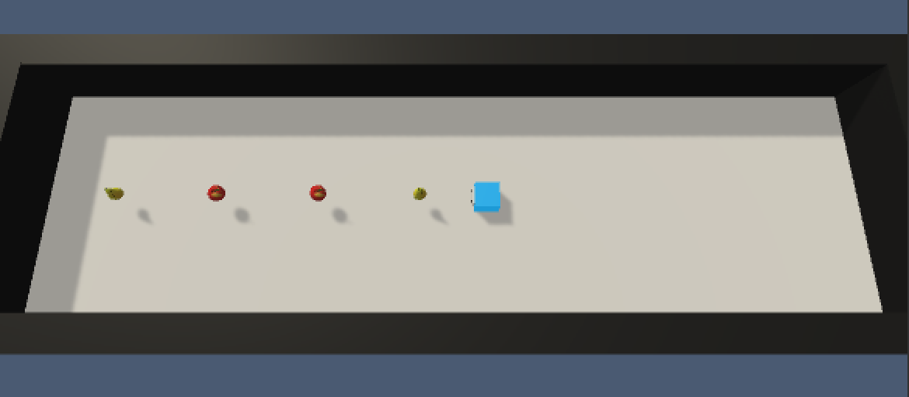
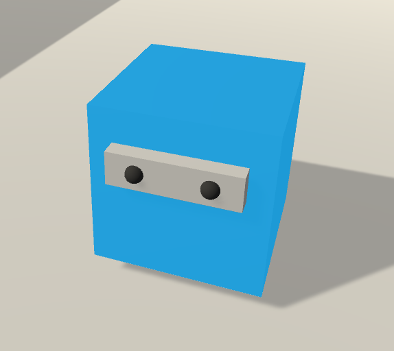
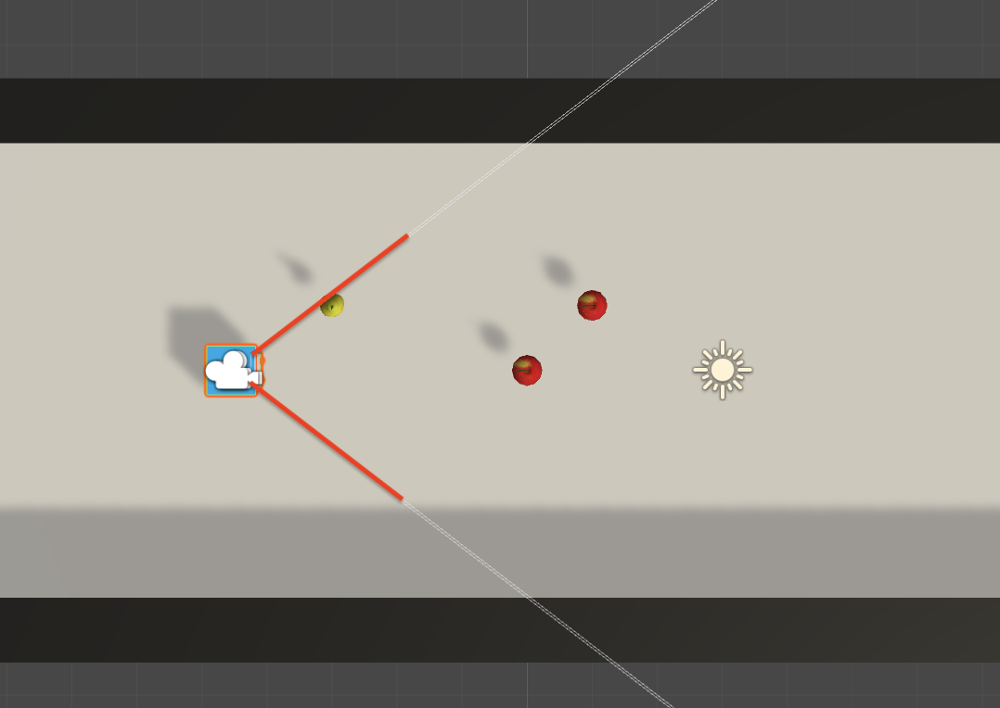
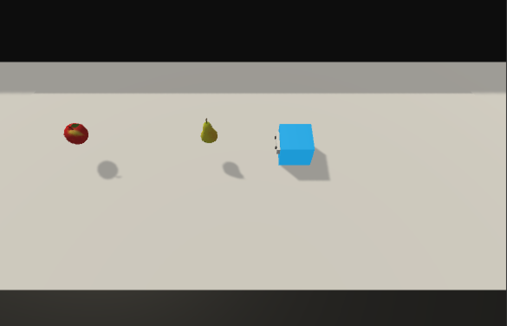
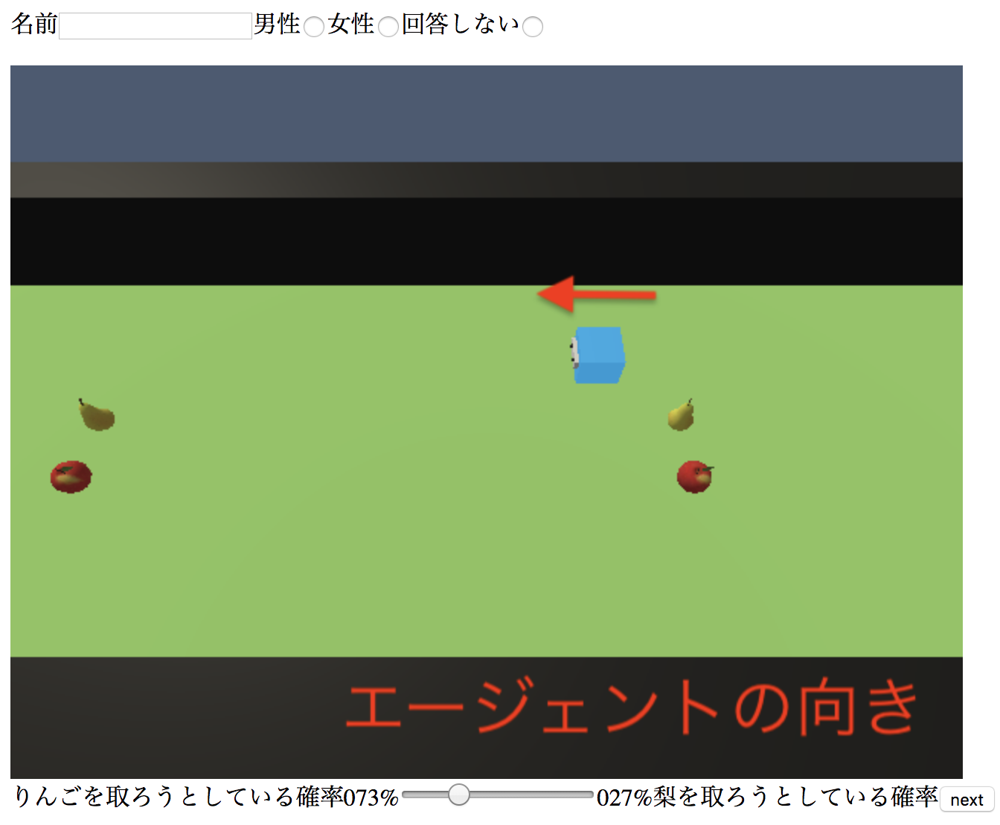

- 以下をよく読んで、「おためし」→「はじめる」を押してはじめてください。

# 設定
- 環境にはつねに、りんご2つ、梨2つとエージェントが存在します。

  

- エージェントは、白い枠に黒い点が二つ付いている方が前です。
     
  - 白い枠にはカメラがついていて、そこから周囲を観測しています。
  - エージェントの視界は、こんな感じです。
  
      

- あなたは下図のように、ある場所から見えるエージェントの動きを、コマ送りで見ていると思ってください。
  - (一番上の画像に比べてあなたの視界が狭いことがわかると思います。)
  
   

- エージェントはりんごか梨のどちらかを取ろうとして動いています。
  - ただし、エージェントは最初りんごと梨がどこにあるか知りません。
- あなたには、自分の視界からエージェントの動きを見て、エージェントがりんごと梨のどちらを取ろうとしているか想像し、確率で答えてもらいます。

# 操作
- 実際の操作画面はこんな感じです。

- まず、上の名前と性別を記入してください。
- 次に、下のnextボタンを押してください。
- 中央に画像が表示されます。
- エージェントがりんごと梨のどちらを取ろうとしているか想像して、下のバーで確率を回答してください。
  - スライダーを左に寄せるほど、「エージェントはりんごを取ろうとしている」確率が高いと考えていると言うことになります。
  - 絶対にりんごだと思う時の確率が100%/0%、りんごか梨か判断つかない状態が、50%/50%です。

- スライダーを操作したらnextボタンを押すことで、次のフレームに進めます。
- 複数エピソード見てもらいます。
  - 新しいエピソードが始まるたびにスライドは元の位置に戻ります。
  - エピソードの最初のフレームでは、エージェントがどこを向いているかわからなくなることを防ぐため、赤い矢印でエージェントの顔の向きを入れていることがあります

[おためし](test.html)
[本番](test2.html)

